# React-Native跨端App 主要功能听歌，刷短视频
1. App基于react-native 版本0.68.1 2022年5月最新版本
2. 后端在该项目同级仓库listenmusic-server
3. 项目启动（需要配置好android和ios环境,参考react-native官网）
4. 进入项目根目录 yarn 安装依赖
5. 执行yarn ios 或 yarn android
# 部分功能展示
### 首页
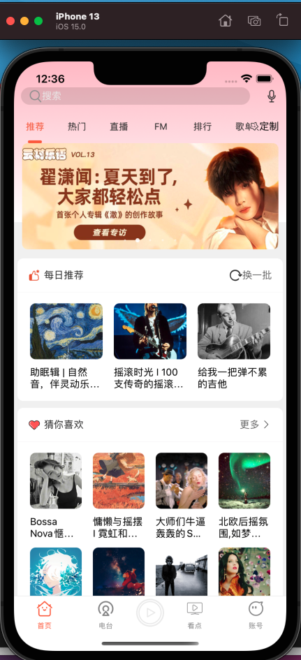

### 下滑刷新 
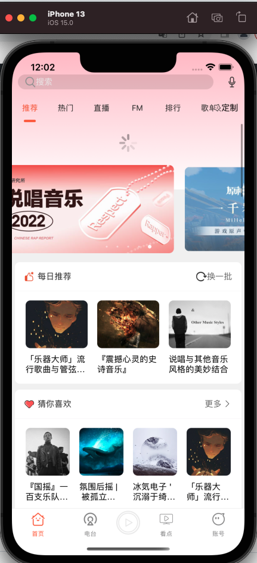
### 上滑加载更多
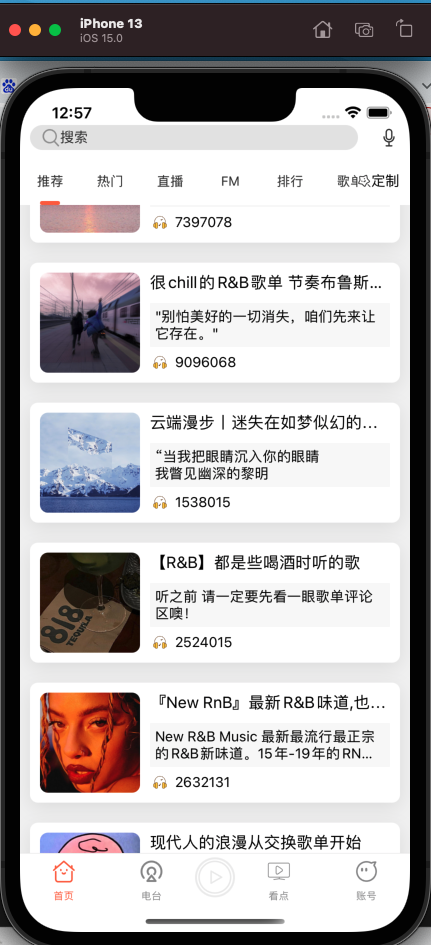

### 播放音乐 点击【猜你喜欢】第一个
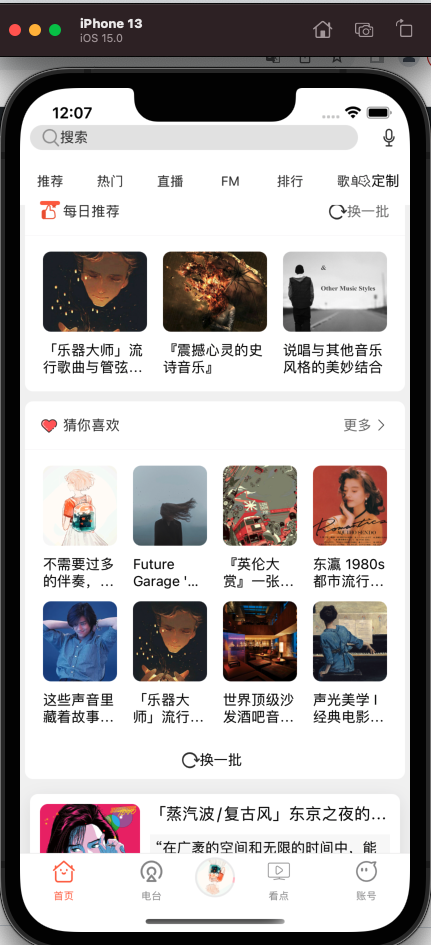
### 进入歌单 点一首播放
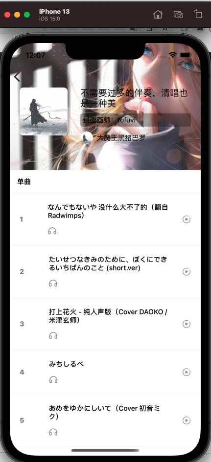
### 歌曲播放页
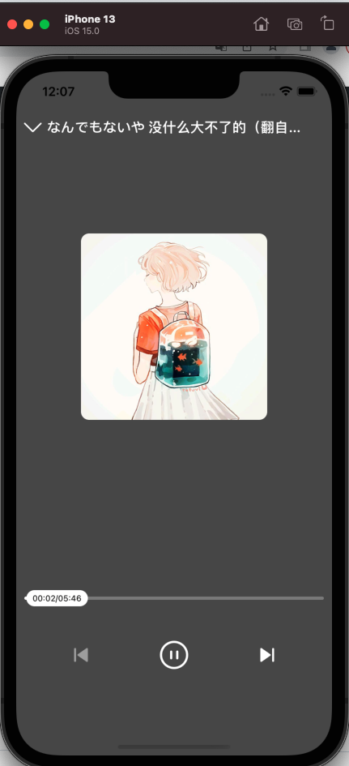

### 点击中间图片 缩放图片并显示弹幕
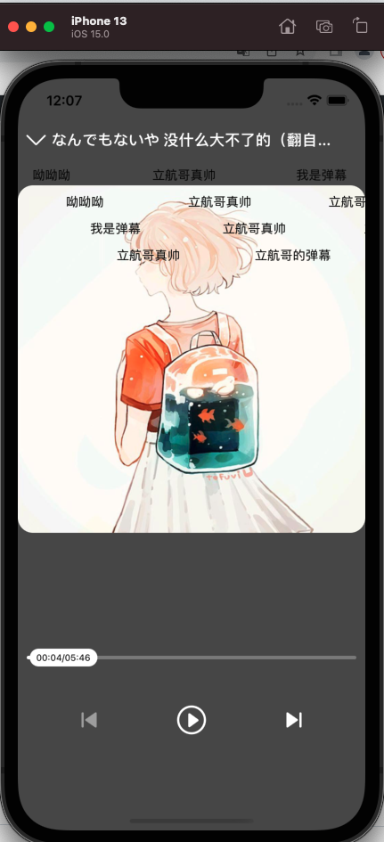

### 手势相应 向下划 会进入首页 底部导航栏会转动刚播放的音乐，再次点击进入歌曲播放页

### 其他歌曲展示
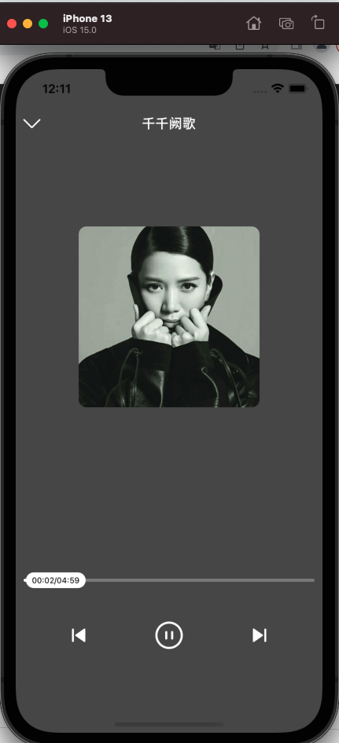

### 视频播放  底部标签点【看点】
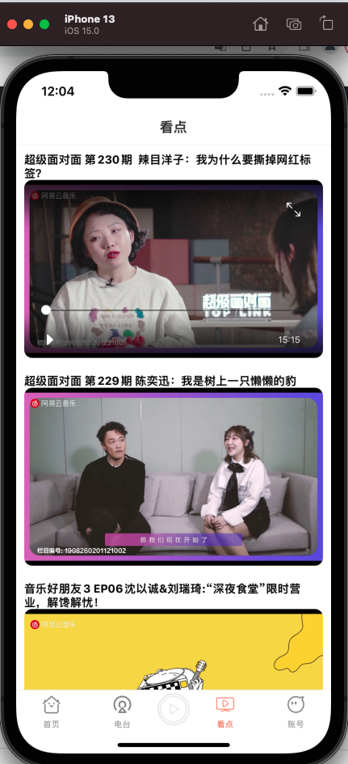

### 定制顶部标签导航器 首页又上角 点定制 定制后的标签会显示在顶部
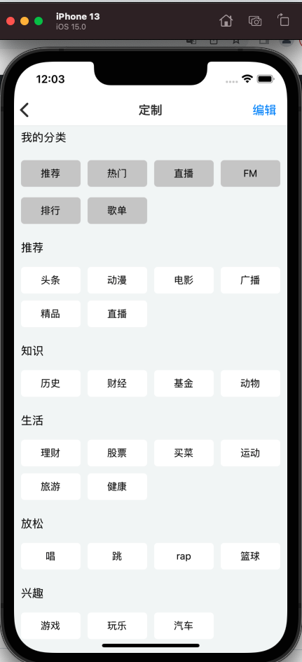

### 用户账户 登录后可以看播放记录 推荐你喜欢的相关音乐，视频
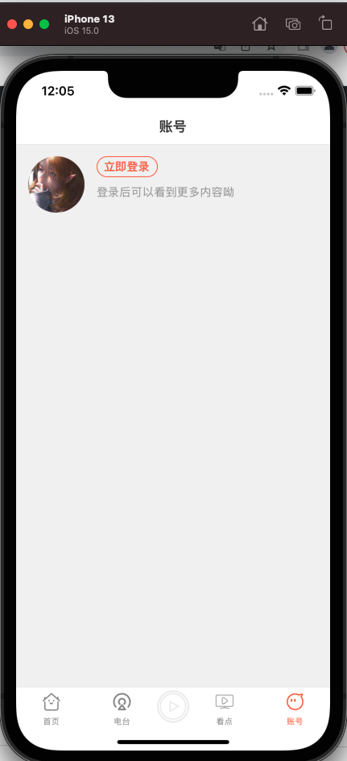
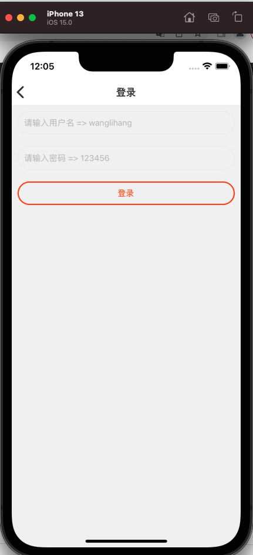